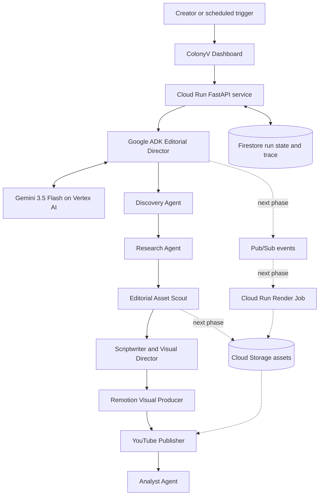

<p align="center">
  
</p>

<h1 align="center">ColonyV</h1>

<p align="center"><strong>An autonomous editorial newsroom that discovers, verifies, produces, and publishes story-specific short-form video.</strong></p>

<p align="center">
  <a href="./README_GOOGLE_CLOUD.md">Google Cloud Setup</a>
</p>

ColonyV is built for the **Taskmaster** track of the All Things Agentic Hackathon. Gemini and Google ADK make editorial decisions, Firestore records live agent state, Remotion creates 1080x1920 motion graphics, and YouTube receives the final public video.

## Architecture



Current production path:

```text
Cloud Run dashboard/API -> Google ADK Editorial Director -> Gemini on Vertex AI
                       -> Firestore run state and live Agent Workspace
                       -> Discovery -> Research -> Script -> ScenePlan -> Remotion -> YouTube -> Analyst
```

**7 autonomous agents** run sequentially per story:

| Step | Agent | What it does | Output |
|------|-------|-------------|--------|
| 1 | **Monitor** | Scans RSS feeds, scores stories by relevance/novelty/urgency via LLM | `*_monitor.json` |
| 2 | **Research** | Crawls source URLs, extracts content, fact-checks via LLM | `*_research.json` |
| 3 | **Scriptwriter** | Generates hook/body/CTA script with visual beats via LLM | `*_script.json` |
| 4 | **ScenePlanner** | Picks a Remotion scene template per beat (stat/diagram/kinetic/image/timeline/quiet) with exact figures | `*_scene_plan.json` |
| 5 | **Producer** | TTS narration + Remotion video render (portrait 1080x1920) | `*.mp4` |
| 6 | **Publisher** | OAuth2 upload to YouTube with title/description/tags | YouTube URL |
| 7 | **Analyst** | Post-run performance analysis, learns from feedback signals | `analyst_output.json` |

## Tech Stack

- **LLM**: Google Gemini through Vertex AI (`gemini-3.5-flash`)
- **TTS**: edge-tts (`en-US-AndrewNeural`)
- **Video**: Remotion 4.0.514 + Chromium
- **Dashboard**: FastAPI + Jinja2 + WebSocket (10-tab SPA)
- **YouTube**: Google API OAuth2 with auto token refresh
- **Framework**: Google ADK

## Prerequisites

- Python 3.13+
- Node.js 18+
- Chromium (`/usr/bin/chromium`)
- FFmpeg
- Gemini through Vertex AI with Google Cloud credentials, or a Gemini Developer API key for local testing
- A Google Cloud project with YouTube Data API v3 enabled (for publishing)

## Installation

```bash
# Clone
git clone https://github.com/salmansanusisani/colonyv.git
cd colonyv

# Python venv
python3 -m venv .venv
source .venv/bin/activate
pip install -r requirements.txt

# Node dependencies (Producer)
cd producer && npm install && cd ..

# Configure Gemini through Vertex AI
export GOOGLE_CLOUD_PROJECT="your-project-id"
export GOOGLE_CLOUD_LOCATION="global"
export GOOGLE_GENAI_USE_VERTEXAI="true"
export COLONYV_GEMINI_MODEL="gemini-3.5-flash"
```

## Running

### Web Dashboard

```bash
source .venv/bin/activate
python3 -m uvicorn dashboard.app:app --host 0.0.0.0 --port 8000
```

Open **http://localhost:8000** — 10 tabs:

| Tab | Purpose |
|-----|---------|
| **Pipeline** | Start/stop pipeline, live terminal logs, progress bar |
| **Past Runs** | History of all runs, click for per-story detail modal |
| **Analytics** | Charts: stories/day, avg score, YouTube views, success rate |
| **YouTube** | Connect/disconnect channel, view uploaded videos, retry failed |
| **Feeds** | Edit/add/remove RSS feeds, enable/disable per feed |
| **Scheduler** | Set auto-run interval (hourly/daily/weekly), next run time |
| **Alerts** | Configure Slack webhook or email notifications |
| **Costs** | LLM call counts, estimated spend per run |
| **Logs** | Full terminal output from every agent (streams live via WebSocket) |
| **Manual** | Architecture guide, tab-by-tab docs, tech stack reference |

### CLI

```bash
# Run full pipeline (1 story, skip YouTube)
python3 agents/pipeline.py --stories 1 --skip-publish

# Run with sandbox mode (no YouTube upload)
python3 agents/pipeline.py --stories 2 --sandbox

# Run individual agents
python3 agents/monitor/monitor.py --top 5
python3 agents/research/research.py --story-json output/xxx_monitor.json
python3 agents/scriptwriter/scriptwriter.py --research-json output/xxx_research.json
python3 agents/publisher/youtube.py upload video.mp4 --title "Title" --privacy unlisted
python3 agents/publisher/youtube.py auth  # Re-authenticate YouTube
```

### YouTube Setup

1. Create a Google Cloud project at [console.cloud.google.com](https://console.cloud.google.com)
2. Enable **YouTube Data API v3**
3. Create OAuth 2.0 credentials (Desktop App type)
4. Download `client_secret.json` and place it at `agents/publisher/client_secret.json`
5. Either:
   - **Dashboard**: Go to YouTube tab → Upload Secret → Connect (browser popup flow)
   - **CLI**: `python3 agents/publisher/youtube.py auth`
6. First upload will open a browser for Google consent

### Custom RSS Feeds

Edit `agents/monitor/feeds.json` or use the **Feeds** tab in the dashboard:

```json
[
  {
    "name": "TechCrunch AI",
    "url": "https://techcrunch.com/category/artificial-intelligence/feed/",
    "enabled": true,
    "category": "tech"
  }
]
```

## Project Structure

```
colonyv/
├── agents/
│   ├── monitor/monitor.py      # RSS feed scanner + LLM scoring
│   ├── research/research.py    # Web crawl + extraction + LLM analysis
│   ├── scriptwriter/scriptwriter.py  # LLM script generation
│   ├── publisher/youtube.py    # YouTube OAuth2 + upload
│   ├── analyst/analyst.py      # Performance analysis + learning
│   ├── pipeline.py             # Sequential pipeline orchestrator
│   ├── cleanup.py              # Old output cleanup
│   └── status.py               # Health checks + recent runs
├── producer/
│   ├── build_video.py          # TTS + SFX + image gen + Remotion render
│   ├── src/
│   │   ├── Video.tsx           # Main Remotion composition
│   │   ├── Root.tsx            # Composition registration
│   │   └── index.ts            # Entry point
│   └── public/                 # Audio, images, SFX
├── dashboard/
│   ├── app.py                  # FastAPI backend (API + pipeline runner)
│   └── templates/dashboard.html  # 10-tab SPA frontend
├── contracts/                  # JSON schemas for all agent I/O
├── tests/
│   ├── test_parser.py          # JSON parser tests
│   └── test_agents.py          # Agent integration tests
├── requirements.txt
├── .gitignore
└── README.md
```

## Environment Variables

| Variable | Required | Description |
|----------|----------|-------------|
| `GOOGLE_CLOUD_PROJECT` | Production | Google Cloud project used by Vertex AI |
| `GOOGLE_CLOUD_LOCATION` | Production | Vertex AI location, normally `global` |
| `GOOGLE_GENAI_USE_VERTEXAI` | Production | Set to `true` for Vertex AI |
| `GOOGLE_API_KEY` | Local alternative | Gemini Developer API key |
| `COLONYV_GEMINI_MODEL` | No | Gemini model identifier |
| `REMOTION_CHROMIUM_EXECUTABLE_PATH` | No | Path to Chromium (default: `/usr/bin/chromium`) |

## Dashboard Configuration

Open **Setup & Settings** before running the pipeline. The settings are stored locally in `config/settings.json`, which is ignored by git:

- `videos_per_run`: number of stories processed for each manual or scheduled run
- `skip_publish`: render-only mode when enabled
- YouTube publishing is public by design for dashboard runs.
- `max_duration_seconds`: narration target passed to the scriptwriter
- `model.provider`: currently LiteLLM-compatible providers
- `model.model_id`: provider model identifier
- `model.api_keys`: separate provider keys stored locally and masked in the dashboard API
- content categories, brand voice, RSS feeds, scheduler, and notifications

Use the dashboard controls as follows:

- **Run Pipeline** starts a new run using the saved settings.
- **Pause** freezes the active child process and pauses timeout accounting.
- **Resume** continues the paused process.
- **Stop Completely** terminates the process tree and marks the run stopped.
- The live terminal receives every subprocess line through WebSocket and each run also writes `output/<run_id>/pipeline.log`.

The production agent uses Google Gemini only. The dashboard model screen is now locked to Gemini and the pipeline does not accept other AI providers.

## Google ADK Production Path

The All Things Agentic Hackathon production path uses Gemini, Google ADK, Cloud Run, and Firestore, authenticated with Vertex AI Application Default Credentials (no API keys).

```bash
pip install -r requirements.txt
gcloud auth application-default login
export GOOGLE_CLOUD_PROJECT="your-project-id"
export GOOGLE_CLOUD_LOCATION="global"
python3 scripts/check_gemini.py --vertex
adk web colonyv_agent
```

The ADK Editorial Director exposes `root_agent` (interactive Q&A) and `production_agent` (autonomous production director). The production director's tool suite operates the real production agents — `discover_stories`, `research_story`, `write_script`, `request_render`, `publish_to_youtube`, `analyze_performance` — and the factory driver (`colonyv_agent/factory.py`) runs the full loop with editorial gates (story rejection, research retry/stop, render retry, upload retry). The publication gate never aborts a run: a story that fails verification is re-verified, then the next candidate is tried, and as a last resort the best available video is published anyway.

See [README_GOOGLE_CLOUD.md](README_GOOGLE_CLOUD.md) for Vertex AI, Firestore, Docker, and Cloud Run setup.

## Key Files

| File | Purpose |
|------|---------|
| `agents/monitor/feeds.json` | RSS feed URLs (dashboard-editable) |
| `agents/monitor/seen.json` | Dedup state — already-processed stories |
| `agents/publisher/youtube_token.json` | YouTube OAuth2 tokens (auto-generated) |
| `output/cost_log.json` | LLM cost tracking across runs |
| `output/feedback_signals.json` | Analyst learned signals |

## License

MIT
