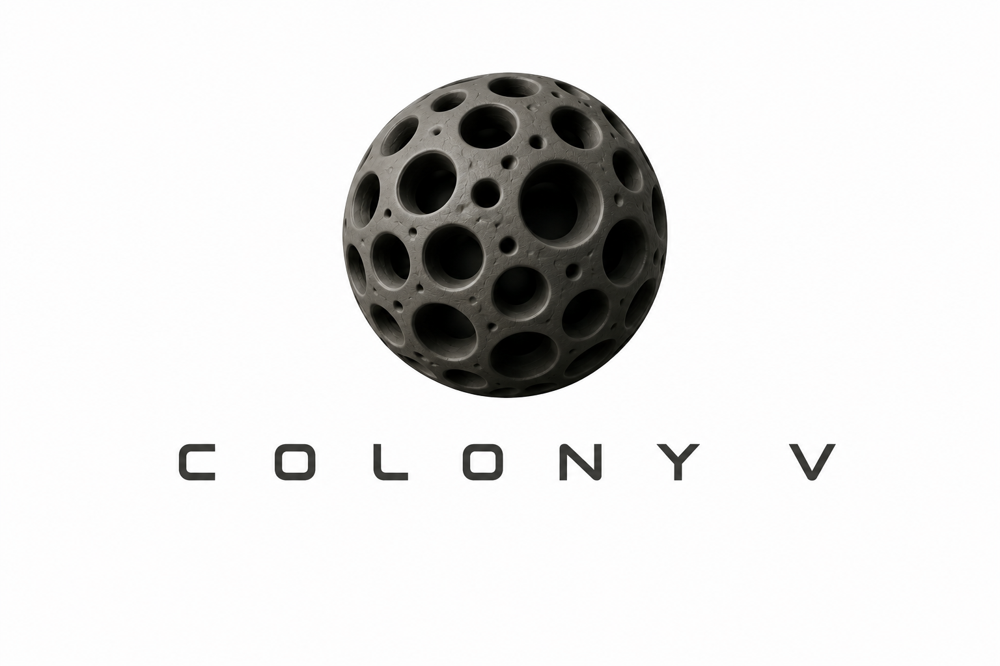
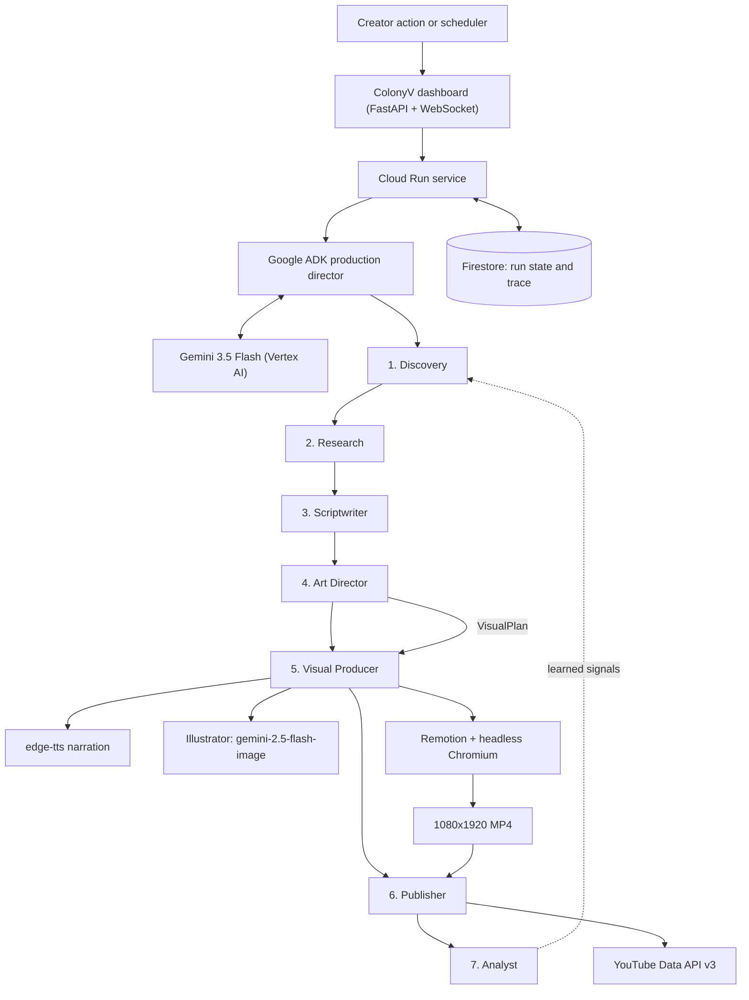

<p align="center">
  
</p>

<h1 align="center">ColonyV</h1>

<p align="center"><strong>An autonomous editorial newsroom that discovers, verifies, produces, and publishes story-specific short-form video.</strong></p>

<p align="center">
  <a href="./README_GOOGLE_CLOUD.md">Google Cloud Setup</a>
</p>

ColonyV is built for the **Taskmaster** track of the All Things Agentic Hackathon. Gemini and Google ADK make editorial decisions, Firestore records live agent state, Remotion creates 1080x1920 motion graphics, and YouTube receives the final public video.

## Architecture



Production path:

```text
Cloud Run dashboard/API -> Google ADK production director -> Gemini on Vertex AI
                        -> Firestore run state and live Agent Workspace
                        -> Discovery -> Research -> Script -> Art Director
                        -> Visual Producer (narration + illustration + Remotion)
                        -> YouTube -> Analyst
```

**7 autonomous agents** run sequentially per story:

| Step | Agent | What it does | Output |
|------|-------|-------------|--------|
| 1 | **Discovery** | Scans RSS and topic search, scores candidates on relevance/novelty/urgency with Gemini | `*_monitor.json` |
| 2 | **Research** | Crawls sources, extracts text with a self-healing scraper, verifies each claim and records contradictions and confidence | `*_research.json` |
| 3 | **Scriptwriter** | Writes hook/body/CTA and proposes visual beats, using only claims research verified | `*_script.json` |
| 4 | **Art Director** | Designs this specific episode: concept, semantic palette, illustration style contract, and a per-shot composition and illustration brief | `*_visual_plan.json` |
| 5 | **Visual Producer** | Narrates with TTS, measures real audio durations, generates illustrations, and renders the composition with Remotion | `*.mp4` |
| 6 | **Publisher** | OAuth2 upload to YouTube with generated title, description, and tags. The publication gate reports its verdict but does not abort the run — see below | YouTube URL |
| 7 | **Analyst** | Reviews the finished run and writes learned signals back into Discovery and Scriptwriter prompts | `analyst_output.json` |

### How a video is designed

The visual system is generative rather than templated. There is no fixed set of
scene templates to pick from; the Art Director writes a **VisualPlan**
(`contracts/visual_plan.schema.json`) and the renderer composes it from
independent layers.

- **Semantic colour.** The accent is a decision, not a keyword match. A verified
  outcome is green, a failure or risk is red, a story whose colour would be
  arbitrary stays monochrome. Ground and ink are fixed brand constants, so an
  episode can never drift off-brand.
- **Ten composable layouts.** `hero_statement`, `illustration_full`,
  `illustration_top`, `illustration_side`, `data_readout`, `node_flow`,
  `timeline_rail`, `compare_two_up`, `quote_block`, `outro_brand`. Every shot
  chooses a layout, a type scale, a text anchor, the words to emphasise, and a
  transition.
- **Generated illustrations.** Each art-bearing shot gets a bespoke illustration
  from `gemini-2.5-flash-image`, drawn to a style contract the Art Director wrote
  for this episode, on the brand's paper ground, wordless, and generated at the
  aspect ratio of the region that will display it. Plates are content-hash cached,
  so a re-render never pays twice.
- **Audio-locked timing.** Narration is generated first and measured with
  `ffprobe`; shot durations are derived from real audio length, so visuals cannot
  drift out of sync.
- **Graceful degradation.** If the Art Director fails, the producer directs
  inline. If an illustration fails, that shot loses its plate and downgrades to a
  typographic layout. A missing illustration never fails a video.

## Tech Stack

- **Reasoning**: Google Gemini through Vertex AI (`gemini-3.5-flash`)
- **Illustration**: Gemini image generation (`gemini-2.5-flash-image`), 
  content-hash cached
- **TTS**: edge-tts (`en-US-AndrewNeural`), measured with `ffprobe`
- **Video**: Remotion 4 + headless Chromium, 1080x1920 at 30fps
- **Dashboard**: FastAPI + Jinja2 + WebSocket (10-tab SPA)
- **State**: Firestore run state and trace
- **YouTube**: Google API OAuth2 with auto token refresh
- **Framework**: Google ADK

## Prerequisites

- Python 3.13+
- Node.js 18+
- Chromium (`/usr/bin/chromium`)
- FFmpeg
- Gemini through Vertex AI with Google Cloud credentials, or a Gemini Developer API key for local testing
- A Google Cloud project with YouTube Data API v3 enabled (for publishing)

## Installation

```bash
# Clone
git clone https://github.com/salmansanusisani/colonyv.git
cd colonyv

# Python venv
python3 -m venv .venv
source .venv/bin/activate
pip install -r requirements.txt

# Node dependencies (Producer)
cd producer && npm install && cd ..

# Configure Gemini through Vertex AI
export GOOGLE_CLOUD_PROJECT="your-project-id"
export GOOGLE_CLOUD_LOCATION="global"
export GOOGLE_GENAI_USE_VERTEXAI="true"
export COLONYV_GEMINI_MODEL="gemini-3.5-flash"
```

## Running

### Web Dashboard

```bash
source .venv/bin/activate
python3 -m uvicorn dashboard.app:app --host 0.0.0.0 --port 8000
```

Open **http://localhost:8000** — 10 tabs:

| Tab | Purpose |
|-----|---------|
| **Pipeline** | Start/stop pipeline, live terminal logs, progress bar |
| **Past Runs** | History of all runs, click for per-story detail modal |
| **Analytics** | Charts: stories/day, avg score, YouTube views, success rate |
| **YouTube** | Connect/disconnect channel, view uploaded videos, retry failed |
| **Feeds** | Edit/add/remove RSS feeds, enable/disable per feed |
| **Scheduler** | Set auto-run interval (hourly/daily/weekly), next run time |
| **Alerts** | Configure Slack webhook or email notifications |
| **Costs** | LLM call counts, estimated spend per run |
| **Logs** | Full terminal output from every agent (streams live via WebSocket) |
| **Manual** | Architecture guide, tab-by-tab docs, tech stack reference |

### CLI

```bash
# Render one story end to end without uploading
python3 agents/pipeline.py --stories 1 --sandbox

# Same thing, explicit flag
python3 agents/pipeline.py --stories 1 --skip-publish

# Run individual agents
python3 agents/monitor/monitor.py --top 5
python3 agents/research/research.py --story-json output/xxx_monitor.json
python3 agents/scriptwriter/scriptwriter.py --research-json output/xxx_research.json
python3 agents/artdirector/artdirector.py --script-json output/xxx_script.json \
    --research-json output/xxx_research.json --illustrations 4
python3 producer/build_video.py output/xxx_script.json --output out.mp4
python3 agents/publisher/youtube.py upload video.mp4 --title "Title" --privacy unlisted
python3 agents/publisher/youtube.py auth  # Re-authenticate YouTube
```

### YouTube Setup

1. Create a Google Cloud project at [console.cloud.google.com](https://console.cloud.google.com)
2. Enable **YouTube Data API v3**
3. Create OAuth 2.0 credentials (Desktop App type)
4. Download `client_secret.json` and place it at `agents/publisher/client_secret.json`
5. Either:
   - **Dashboard**: Go to YouTube tab → Upload Secret → Connect (browser popup flow)
   - **CLI**: `python3 agents/publisher/youtube.py auth`
6. First upload will open a browser for Google consent

### Custom RSS Feeds

Edit `agents/monitor/feeds.json` or use the **Feeds** tab in the dashboard:

```json
[
  {
    "name": "TechCrunch AI",
    "url": "https://techcrunch.com/category/artificial-intelligence/feed/",
    "enabled": true,
    "category": "tech"
  }
]
```

## Project Structure

```
colonyv/
├── agents/
│   ├── monitor/monitor.py           # RSS + topic scan, Gemini scoring
│   ├── research/research.py         # Crawl, extract, verify claims
│   ├── scriptwriter/scriptwriter.py # Hook/body/CTA + visual beats
│   ├── artdirector/artdirector.py   # Authors the VisualPlan for one episode
│   ├── publisher/youtube.py         # YouTube OAuth2 + upload
│   ├── analyst/analyst.py           # Post-run analysis + learned signals
│   ├── pipeline.py                  # Sequential CLI orchestrator
│   ├── cleanup.py                   # Old output cleanup
│   └── status.py                    # Health checks + recent runs
├── producer/
│   ├── build_video.py               # 6-stage producer: narrate, measure,
│   │                                #   direct, illustrate, stage, render
│   ├── illustrate.py                # Gemini illustration engine + cache
│   └── src/
│       ├── Root.tsx                 # Composition + duration from props
│       ├── Video.tsx                # Plan-driven timeline builder
│       ├── layouts.tsx              # Shot composer (the 10 layouts)
│       ├── theme.ts                 # Brand constants, motion languages
│       ├── types.ts                 # TypeScript mirror of the VisualPlan
│       └── layers/                  # Paper, Plate, Copy, Data, Callout,
│                                    #   Brand, Transition
├── colonyv_agent/                   # Google ADK agents, tools, and stages
│   ├── agent.py                     # root_agent + production_agent
│   ├── factory.py                   # Full autonomous loop with gates
│   ├── stages.py                    # Stage graph and gate decisions
│   └── tools/                       # pipeline tools + editorial gates
├── dashboard/
│   ├── app.py                       # FastAPI backend + pipeline runner
│   └── templates/dashboard.html     # 10-tab SPA
├── contracts/                       # JSON schemas for every agent boundary
│   └── visual_plan.schema.json      # The Art Director's output contract
├── tests/                           # 65 tests
├── Dockerfile                       # Python + Node + Chromium + FFmpeg
├── requirements.txt
└── README.md
```

## Reproducible Testing

Judges and evaluators can verify COLONY-V locally using the following reproducible test commands:

### 1. Run Automated Test Suite (Pytest)

The repository includes 65 unit and integration tests covering JSON contract
validation, agent schemas, publication policy gates, runtime pause/resume/stop
mechanics, and the visual system — Art Director sanitisation and layout repair,
illustration budget enforcement, per-layout aspect selection, and ground-tone
matching:

```bash
source .venv/bin/activate
pytest -v
```

### 2. Verify the Renderer

Type-check the layer library, layout composer and timeline builder:

Validate that the layer library, layout composer, and timeline builder pass
strict TypeScript compilation:

```bash
cd producer && npx tsc --noEmit && cd ..
```

Type-checking proves the composition compiles, not that it renders. To render one
still per layout in headless Chromium and catch runtime failures a type-checker
cannot see:

```bash
COLONYV_RENDER_SMOKE=1 pytest tests/test_render_smoke.py -v
```

### 3. Verify Gemini / Vertex AI Connectivity

Verify that your Google Cloud Vertex AI or Gemini environment credentials are authenticated and responsive:

```bash
# For Vertex AI (ADC)
python3 scripts/check_gemini.py --vertex

# Or with an API key
python3 scripts/check_gemini.py --key YOUR_GEMINI_API_KEY
```

### 4. Sandbox Dry-Run (End-to-End Pipeline without YouTube upload)

Execute an offline end-to-end editorial run that fetches stories, fact-checks, scripts, and renders motion graphics without uploading to YouTube:

```bash
# Run 1 complete story in sandbox mode
python3 agents/pipeline.py --stories 1 --sandbox
```

### 5. Launch Local Mission Control Dashboard

Start the FastAPI mission control dashboard to test the real-time WebSocket logs, interactive DAG tracker, and manual agent trigger:

```bash
python3 -m uvicorn dashboard.app:app --host 0.0.0.0 --port 8000
```
Then navigate to **`http://localhost:8000`** in your browser.

---

## Environment Variables

| Variable | Required | Description |
|----------|----------|-------------|
| `GOOGLE_CLOUD_PROJECT` | Production | Google Cloud project used by Vertex AI |
| `GOOGLE_CLOUD_LOCATION` | Production | Vertex AI location, normally `global` |
| `GOOGLE_GENAI_USE_VERTEXAI` | Production | Set to `true` for Vertex AI |
| `GOOGLE_API_KEY` | Local alternative | Gemini Developer API key |
| `COLONYV_GEMINI_MODEL` | No | Gemini model identifier |
| `REMOTION_CHROMIUM_EXECUTABLE_PATH` | No | Path to Chromium (default: `/usr/bin/chromium`) |
| `COLONYV_IMAGE_MODEL` | No | Illustration model (default `gemini-2.5-flash-image`) |
| `COLONYV_ILLUSTRATION_BUDGET` | No | Max illustrations per video. Unset scales the budget to the shot count, bounded 2..6 |
| `COLONYV_ILLUSTRATION_WORKERS` | No | Concurrent image requests (default `1`) |
| `COLONYV_ILLUSTRATION_INTERVAL` | No | Seconds between image requests (default `1.5`) |
| `COLONYV_CACHE_BUCKET` | No | Cloud Storage bucket backing the illustration cache. Without it the cache is local only, which on Cloud Run means re-paying for identical images after every deploy |
| `COLONYV_CACHE_PREFIX` | No | Object prefix inside that bucket (default `illustrations`) |
| `COLONYV_RENDER_SMOKE` | No | Set to `1` to enable the per-layout render smoke test |
| `PRODUCER_TIMEOUT` | No | Render timeout in seconds (default `1800`) |

## Dashboard Configuration

Open **Setup & Settings** before running the pipeline. The settings are stored locally in `config/settings.json`, which is ignored by git:

- `videos_per_run`: number of stories processed for each manual or scheduled run
- `skip_publish`: render-only mode when enabled
- YouTube publishing is public by design for dashboard runs.
- `max_duration_seconds`: narration target passed to the scriptwriter
- `model.provider`: currently LiteLLM-compatible providers
- `model.model_id`: provider model identifier
- `model.api_keys`: separate provider keys stored locally and masked in the dashboard API
- content categories, brand voice, RSS feeds, scheduler, and notifications

Use the dashboard controls as follows:

- **Run Pipeline** starts a new run using the saved settings.
- **Pause** freezes the active child process and pauses timeout accounting.
- **Resume** continues the paused process.
- **Stop Completely** terminates the process tree and marks the run stopped.
- The live terminal receives every subprocess line through WebSocket and each run also writes `output/<run_id>/pipeline.log`.

The production agent uses Google Gemini only. The dashboard model screen is now locked to Gemini and the pipeline does not accept other AI providers.

## Google ADK Production Path

The All Things Agentic Hackathon production path uses Gemini, Google ADK, Cloud Run, and Firestore, authenticated with Vertex AI Application Default Credentials (no API keys).

```bash
pip install -r requirements.txt
gcloud auth application-default login
export GOOGLE_CLOUD_PROJECT="your-project-id"
export GOOGLE_CLOUD_LOCATION="global"
python3 scripts/check_gemini.py --vertex
adk web colonyv_agent
```

The ADK Editorial Director exposes `root_agent` (interactive Q&A) and `production_agent` (autonomous production director). The production director's tool suite operates the real production agents — `discover_stories`, `research_story`, `write_script`, `direct_visuals`, `request_render`, `publish_to_youtube`, `analyze_performance` — and the factory driver (`colonyv_agent/factory.py`) runs the full loop with editorial gates (story rejection, research retry/stop, render retry, upload retry). The publication gate never aborts a run: a story that fails verification is re-verified, then the next candidate is tried, and as a last resort the best available video is published anyway.

See [README_GOOGLE_CLOUD.md](README_GOOGLE_CLOUD.md) for Vertex AI, Firestore, Docker, and Cloud Run setup.

## Key Files

| File | Purpose |
|------|---------|
| `agents/monitor/feeds.json` | RSS feed URLs (dashboard-editable) |
| `agents/monitor/seen.json` | Dedup state — already-processed stories |
| `agents/publisher/youtube_token.json` | YouTube OAuth2 tokens (auto-generated) |
| `output/cost_log.json` | LLM cost tracking across runs |
| `output/feedback_signals.json` | Analyst learned signals |
| `contracts/visual_plan.schema.json` | The Art Director's output contract |
| `producer/.illustration_cache/` | Content-hash cache of generated plates |

## License

MIT
